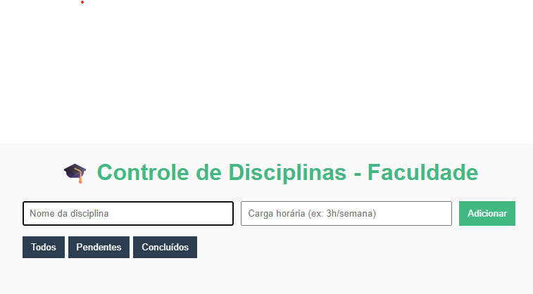
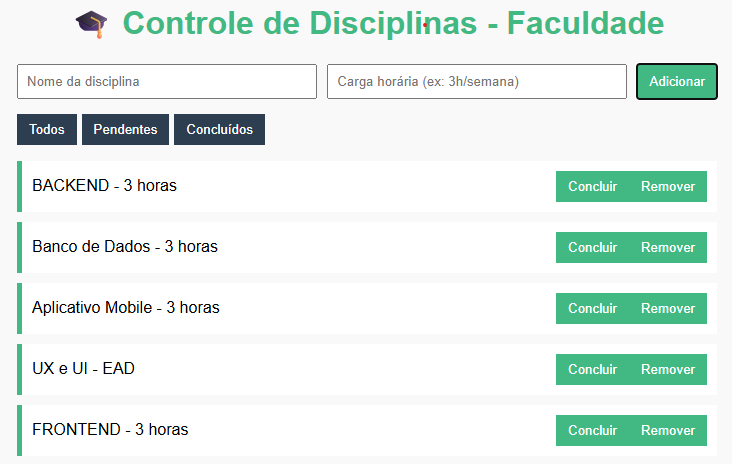

# Vue.js - Projeto de Estudo (Seminário)

Este projeto foi desenvolvido como parte de um seminário prático sobre o framework Vue.js.

## Objetivo

Criar uma aplicação simples utilizando Vue.js para demonstrar os principais conceitos do framework, como:

- Reatividade com `v-model`
- Renderização condicional com `v-if`
- Listas dinâmicas com `v-for`
- Eventos com `@click`
- Separação de código HTML, CSS e JS

## Ferramentas Utilizadas

- HTML5
- CSS3 (arquivo: Style.css)
- JavaScript moderno (ES6)
- Vue.js via CDN (sem build ou CLI)

## Como Executar

1. Faça o download do projeto ou clone o repositório.
2. Abra o arquivo `index.html` no navegador (Chrome, Firefox etc).
3. A aplicação deve rodar localmente sem necessidade de instalação de pacotes.

Ou use a extensão Live Server no VS Code para abrir com servidor local.

## Demonstração



## 📂 Estrutura do Projeto

```
trabalho/
├── index.html
├── Style.css
├── app.js
└── .vscode/ (configurações do VS Code)
```

## Aprendizados

- Estrutura básica de um app Vue sem build tools
- Conceitos fundamentais como diretivas, reatividade e eventos
- Boas práticas com separação de responsabilidades e código limpo

## Licença

Este projeto é acadêmico e foi desenvolvido para fins educacionais.

---

Desenvolvido pelo Grupo 13
